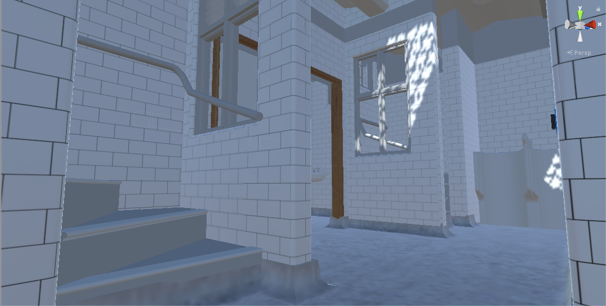

# Portfolio

## Week 1

In the first class of week one, was just an introductory class into what the project was about, and how we were to set up our workstations. We had to do this all manually ourselves to simulate what it would be like in the real world coming into a company that has already up and running. We also found out all the different projects that were available for us to partake in. However, the one project I wanted to do, game development, highly sorted after, so I had to apply for it. This meant that I had to go and talk to my lecturer about becoming part of the group. So I organised a meeting via email (as when I went to see him, he was busy in a meeting), and then the next day I went and had the interview.

In the second class of this week, we found out what projects we would be taking part in. I was lucky enough to find myself being part of the game development group, but in a smaller, less central group. This meant that while I wasn't part of the main game development group, I was still able to be part of a game development project. I also met the people I would be working with, James Grigg (my friend) I already knew, and Nick Mulrooney. Neither James or I had worked with Nick before, so we had to go through the stages of forming a group. This was made significantly easier since everyone was pretty relaxed about everything. We just got along.

*Review*

In review of this week, not a lot happened. It was mostly just getting the team together, and to get a rough idea as to what we would be doing for a project. There wasn't a lot of work completed as we just tried to get to know each other.

## Week 2

In the first class of week two, we were introduced to the software that we would be using for our project. This was unity. It allowed us to simply create 3D games, and have them be ported onto a cellphone to be played on there. However, there was an issue of none of us ever using unity before. This became even more of an issue when unity wouldn't even let us run the basic starting out tutorials. Due to this, I began the Open Mind course but was only able to start it due to what limited time we had left.

In the second class of the week, I mostly focussed on finishing off the Open Mind course while helping Nick complete his version of a collection game. This wasn't a whole lot of work, it was just focussing on realising flaws in my own mindset about conflict, and viewpoints.

*Review*

In review of this week, unity didn't exactly go very well, to begin with. We struggled to get the tutorial going due to some permissions on the computer. Other than that though, the week went well. I was able to finish the Open Mind course, with a score of 92%. Next week I plan on attempting the collection game that Nick was working on.

## Week 3

In week 3, I began working on the collection game. Most of it was straight forward and easy to do, as I was just following along with the online tutorial. There wasn't anything that went wrong with this, as the tutorial is quite easy to understand. The only issue that I had was that because it was a video tutorial, I spent a lot of time sitting around just waiting to code.

*Review*

In review of this week, I managed to get unity working properly and to be able to get a basic game down. Nothing really went wrong, I just felt like I was wasting a lot of time during the tutorial, which could've been better spent doing something else. Next week I shall try and add my own spin on the collection game.

## Week 4

In the first class of week 4, I decided that I would try and make the collection game a little more my own. I decided to do this by randomizing the spawns of each of the collectables around the "world". I also made repeating different "levels", which basically just reset the map whenever the player has collected all the pickups. I plan on adding in tokens which will cause the player to lose. The idea is to have these a somewhat similar colour so that when the user encounters a situation where they are influenced by colour blindness, they two look similar. This is to show the user how difficult life is for a person that is colour blind, where they can constantly mistake one thing for something else.

In the second class of week 4, I started working on adding the colour blindness to the game. It seems really simple to do, all I have to do is add it to the canvas so that it will always influence the player's screen. Our lecturer gave us the idea of using the post-processing pipeline which would be a good thing for me to look into.

*Review*

In review of this week, I found it quite productive. Since I wasn't being held up due to the slow tutorial, I was able to go through and work at my own pace. This meant I was able to get a lot of stuff done. We, unfortunately, might be getting split up into separate  project groups, as Nick already has been. This means it's only James and I left working together. However, we can still help each other out, as we are all still working together, on somewhat similar projects.

## Images of the collection game

*Design*

*Starting out*

*Halfway through*

*End of a level*

## Week 5

In the first class of week 5, I found out that our project group would be separated into 3 different projects. I would no longer be working on stuff for colour blindness, but instead, I would be working on a 3D virtual model of the old Dunedin toilets. This means that I would no longer be working with anyone in the project team. I still have no idea what exactly I would be doing, as the meeting with the modelling lecturers was cancelled due to them being busy.

In the second class of week 5, I meet with the lecturers in polytech who did all the modelling/graphic design. They showed me all their modelling software and other tools that they used to create different 3D structures. They showed me how their software gave them a virtual walk around the models that they had created. They sent me a whole bunch of files to use in my project, so the plan over the next week is to try and import them into unity, without it all crashing down.

*Review*

In review of this week, I found it a little worrying that I was going to be working on this project alone. However, after meeting with the lecturers doing the modelling, I feel like I might be able to do quite well with this project. My next steps are to try and implement the 3D models into unity so that we can see if we can create a realistic walk around for the user.

## Week 6

Over the weekend I attempted to import the models that I was given. For whatever reason, they did not work for me. I contacted the modelling group; they said that they would try and export it differently so that I could get it to work. All I can do now is wait.

In the first class of week 6, we didn't have class. However, the lecturers doing the modelling sent me an updated version of the model, which I was able to import into unity. This allowed me to finally make a walk around through the already created model.

In the second class of week 6, I was able to show my lecturer the attempts at making the walk around. However, we came to the conclusion that the models used in the current walk around were too well defined, which caused unity to crash and burn. Because of this, I contacted the modelling group and asked them for a less intensive model to work with. Over the weekend between week 6 and 7, they contacted me with a newer model, however, this one was lacking in some of the textures that were visible to the user.

*Review*

In review of this week, I found that it was quite productive. I was able to start seeing progress towards a proper working/moving walk around in unity (even though it caused it to crash and burn), but it still progressed. What didn't go well, was also what went well. Because of how dense the model was in terms of detail, it meant that program lagged severely, and was pretty much unplayable. What I want to work on next is, to somehow find a way to get the program to stop lagging as much, and have an easier time running the program.

## Week 7

In the first class of week 7, I started to play around with the new model that I was given, attempting to see where the missing textures were, and if I could fix them. I came up with an idea of using parts of the previously high-cost model since everything was already together. Through doing this, I was able to create a significantly less shuttering program, and in turn a better user experience. In the next class, I aim to finish filling in missing textures, and start adding in little pieces of detail back into the model (from the high-cost version).

In the second class of week 7, thanks to the modelling team who sent me some of the textures for the model, I was able to start adding colours into the model. I also started adding in some detail from the high-cost model, back into the model I was using. This allowed me to add in urinals on both sides of the toilets. In the next class, I plan on adding in more detail into the stalls in the model. My lecturer has given me the idea of keeping all functional parts of the model, separate from the stuff that doesn't move. This will allow for future modification to the game, and allow for the user to interact with the environment.

*Review*

In review of this week, I found that the goal of having a virtual walk around was getting closer. I was able to add in textures to parts of the model so that the model wasn't completely white, and I was able to add in new features into the low-cost model, without it completely destroying unity. Over this week, nothing didn't do that poorly. The only difficult part was lining up parts of the model, so that components wouldn't overlap, but looked like they were connected. For next week, I plan on continuing to add in as much detail into the model as possible, while trying to sustain useibility.

## Week 8

In the first class of week 8, I attempted to continue working with the new model that I was given. However, due to the many missing walls, doors, and details, I decided to move back to the more intensive model. I removed the light sources and some of the highly detailed parts of the model. This meant I was able to still move around without it having 1 frame per second. In the next class, I plan on adding in coloured textures into the model so that the user has an enjoyable visual experience.

In the second class of week 8, I modified the walk around so that it would be more optimized. I did this because the program would start to drop in frames per second every now and then, and also had the opportunity for players to look through walls. So I changed a few of the settings in unity so that the game would work better.

*Review*

In review of this week, I found that I was able to get a working walk around so that the "player" could experience what the old toilets looked like. One thing that didn't go well was that the parts of the model are still missing. This means that I have to go through and add in specific parts to it to fill in the gaps. For next time, I would like to have an interactable environment, so that the player can do stuff while they are walking around.

## Holidays

Over the holidays I worked on getting an interactive environment, which the player can do stuff in. Currently, it only has the ability to open and close doors, and in doing so, sacrificing the ability to walk around. Hopefully, over the next few weeks, I will be able to implement a way for the player to move around while interacting with the environment.

## Week 9

In the first class of week 9, I was finally able to test how my project would run on a VR phone. It, to no surprise, didn't go very well. Due to the excessive amount of objects in the model, the frames per second would drop significantly. While running the statistics on the computer, there was a point where there were 1.5 million triangles and 1.5 million vertices. This would have to be reduced significantly, which I plan to do in the next class.

In the second class of week 9, I was able to start culling the model to remove parts that weren't 100% necessary. This meant that I was finally able to run the project on a phone, while able to look around the model. Though it did mean that I had to remove some parts of the visual model, which could influence how the user experiences the virtual walkthrough.

*Review*

In review of this week, I was able to finally to create a program that is able to run on a mobile device, and in turn, have a visual model which the user could look around in a virtual space. However, while creating my script to open/close doors, I encountered an issue in unity. Unity doesn't have an event handler for hovering over objects, so this meant that I had to create my own. This wasn't that difficult, it just took a while. Next week I plan on continuing to expand on my interactivity in the model, and hopefully being able to get the player moving around the model.

## Week 10

In the first class of week 10, I organised a meeting with the modelling lecturers at the polytech. This was scheduled for Wednesday. In the class, I also managed to implement a way of moving around the model. This is done by the user moving their thumb over the trackpad on the google daydream controller. I also managed to work in a way where the movement will always be determined based on where the player is looking. For example, if the player is looking in one direction, and swipes forward on the controller, the will move in the direction they are looking. Then if the player looks behind them, and swipes forward, the will still move in the direction they are moving.

On Tuesday I decided that my "snapping" doors would look better if they were animated. So I had a look into just rotating objects in the unity space. However, due to the way that the model had been created, just simply rotating them meant that they would go flying off the screen. So I had to create separate game objects for each one of the doors in the model. This way I was able to create a smoother open/close of the doors.

On Wednesday I had my meeting with the modelling lecturers. The said that they had loved what I had done so far and that they didn't have anything that they wanted to be changed. All they wanted me to do, was to send them an email regarding all of the parts of the model which aren't completely there, and a progress report to send to the DCC. I can assume that this means that they are happy with what I've done and that I'm on the right track.

In the second class of week 10, I started working on getting some taps to rotate when clicked on. Instead of creating a new script to handle the movement of the taps, I modified the script that I used for the doors. This meant that I was able to use the script on the taps as well as the doors without too much difficulty. I then proceeded to add this to all of the taps in the model, which now means that there is more functionality.

*Review*

In review of week 10, I was happy with the progress of the project. I was able to create something that they modelling lecturers were happy with, and then I was able to further extend the project by adding in more functionality. However, I'm still faced with the task of having too many objects in the model, which causes the frame rate to drop significantly. I hoping that next week I will be able to reduce the number of objects so that the project doesn't freeze as much while running on a phone.

## Week 11

In the first class of week 11, I decided to work on a way for the user to know if an object they were hovering over was interactable. At first, I came up with the idea of having objects highlight when they were hovered over. I had a look through unity's asset store and tried to use all of the available free highlighting assets, however, none of them seemed to work. While at home, I had an idea of using the tooltips that the controller displays when the user tilts it up. This took a while to get working properly, as tooltips weren't actually attached to the controller as an object. I had to go through the GvrArmModel object to access the ability to get the tooltips to appear/disappear.

In the second class of week 11, I worked towards improving the functionality of turning the taps on and off. I did this by creating a "water" object, which appeared/disappeared when the user clicked on one or more of the taps. This was relatively simple to do, as I just created a new script which used the original script I wrote to turn the taps on and off. This was so that when a user turned on a tap, stuff actually happened, not just the taps turning

*Review*

In review of week 11, I was able to provide more functionality and a way for the user to clearly identify if an object is interactable. I wasn't happy with the amount of time I spent trying to find a hover effect that worked. After doing some research on it, I found that the hover effect wasn't working because my unity GameObject didn't have a complete mesh. So because the model was broken up into tiny pieces, it meant that I couldn't get a hover effect going. Next week I really hope to work on doing some form of performance improvements, I've spoken to my lecturer, and there are two possible ways of doing it. One where we turn parts of the model on and off, and one where we move parts of the model around the unity 3D space but put a camera view onto a plane so that the user still sees what should be there.

## Week 12

In the first class of week 12, I was finally able to work towards some performance improvements for the model. This came in the form of removing parts of the model, based on where the user is standing, using triggers and the top of both sets of stairs. I can further increase performance by removing more and more parts of the model when the user isn't downstairs. However, I have to be careful, as the user can still look down inside the model when they are on the roof. Before this class, I was showing off my project as part of the open day for polytech.

In the second class of week 12, I went through and started trying to fix the missing textures in the model. I was only able to fix some of the doors, and windows, as I just duplicated and flipped parts of the model. This was so that the textures would be on both sides of the "object" even though it's just two of each part. The issue with fixing it this way is that it increases the number of objects that are required to be drawn on the screen, and the number of collisions that need to be detected.

Over the weekend, I participated in the TEXpo held at the polytech. This just meant that I showed off my project to the public coming through the polytech. This was mostly just kids wanting to have a go looking through the VR headsets.

*Review*

In review of week 12, I was able to finally optimise the model to the point where it didn't completely drop frames per second when looking through the main part of the model. I was also able to attempt to fix the parts of the model which were missing textures, and do a sort of hiding method to hide/show parts of the model. One thing that didn't go too well is that in fixing the missing textures in the model. Due to the only way I could fix it, it meant that I had to duplicate parts of the model, which in turn, increased the number of objects causing frame drops. Next week I hope to be able to create a new lighting source for inside the model.

## Week 13

In the first class of week 13, I started working on an attempt at getting the lighting to work. I did this by adding in point lights into the light shade objects in the model and then adding in a "light switch" that I created from two unity cubes. This lit up the model quite well, and I thought it would run well since it did on the computer. However, once I ran it on the phone when you tried to turn the lights on, the whole app would freeze for 5-10 seconds. This was just because, with all the new lights creating shadows, it caused the performance to drop significantly. In the next class, I hope to be able to work on a fix for this.

On Wednesday, I had a meeting with Alison Breese from the DCC. She is the person who had the idea for the project, and passed it onto the modelling people at Polytech and then onto me. I show her the model, and everything that I had done, and showed her the walk around in VR, and she liked everything I had done. The only thing that she wanted me to do, was to have a way to have text appear in the model.

In the second class of week 13, I worked on a solution to the lighting issues. This came down to a single point light that follows the player around, which still gets turned on and off by the light switch. This meant that I was able to have a new source of light inside the model, while not completely killing performance on the phone.

*Review*

In review of week 13, I thought that it went well. I was able to work on a new light source for the model, which meant that the inside of the model was more visible, while not completely killing performance. What didn't go well is that now because of how I've done the new light source, if you don't turn the light off, it will still be on, even when you leave the underground. For next week, I hope to have implemented a way of seeing text appear in the model and sorting the light source out.

## Week 14

We didn't have class on Monday as it was a public holiday.

On Thursday before class, James and I went up to Otago Boys' High School to show off our projects as part of the careers day at the school. The students enjoyed what we had done, staying about how they liked the interactibility of both games.

In the second class of week 14, I started working on a way of getting the text to appear in the model. I did this by when you hover over a light switch for 5 seconds, it would show up a light switch in front of the player's camera. This would appear no matter where the player was looking, as the canvas it was drawing to, was always following the player's camera. However, after talking with my lecturer about it, we decided that it would be better to have the text appear in 3D space, and rather than having to hover over it for a certain period of time, have it fade in and out.

Over the weekend of week 14, I worked on getting the text to appear in 3D space and fading in and out. I did this by adding a canvas into the 3D space, and then adjusting the alpha value of the canvas, by making it appear to fade in and out.

*Review*

In review of week 14, I found that it was quite productive, even though there was just one class. I was able to get an idea of how to make text appear, and then improve on it by having it appear in 3D space. Nothing really went wrong this week. It was just quite time-consuming to find out how to get the canvas to appear/disappear. Next week I hope to add in actual information about the model, so that when a user hovers over an "information point" they are able to see new information.

## Week 15

In the first class of week 15, I continued to work on making the on-screen text look better in 3D space. While I only had one 'information box' in the actual model, it was a good start to getting the text boxes going. This is because Alison asked if it was possible for me to have information showing up in the model. My lecturer then gave me the idea to email Alison and ask if she had any information regarding the model itself, so that I could insert that in as well.

On Wednesday I had another meeting with the modelling people from the Polytechnic, show them all the work I had done over the semester with their model. They were extremely happy with the progress I had made and were hoping to further this project into next semester with a new student(s).

In the second class of week 15, I decided that after my meeting with the modelling people, I was finished adding in new features into the model. I decided to work on my documentation, as it appears that I'll be handing this project off to someone else.

*Review*

In review of week 15, I find the project coming to a close. I've enjoyed working on the model that I was given, getting to know how it all used to look, and then getting to make it come to life. I've learnt a lot about working with unity and the GoogleVR elements. Whether it be the ball game I made at the start of the project or the model that I finished with. It was enjoyable getting to bring the model to life. Nothing really went wrong this week. There were a few hiccups when it came to trying to get the text to fade in and out, but other than that, it was a good week. For next week, I just have to finish off my documentation, and then I'm done.

## Week 16

As the semester is coming to a close, it means that the project is at as well. I'm very happy with what I've achieved over the semester, whether it be going through the first ball tutorial, to completing the VR walk around. I have enjoyed working together with the modelling people from the Polytechnic, my lecturer, and my project team (even though we got seperated). I've learnt a lot about using unity. What works, what doesn't work, what really really doesn't work. Hopefully the project can be carried onto next semester.

## Images of the collection game

*Outside*

*Downstairs Mens 1*

*Downstairs Mens 2*

*Downstairs Womens 1*

*Downstairs Womens 2*

*Link to project*
 
<a href='https://github.com/MitchellBriggs/BlindToilets'>Project</a>
